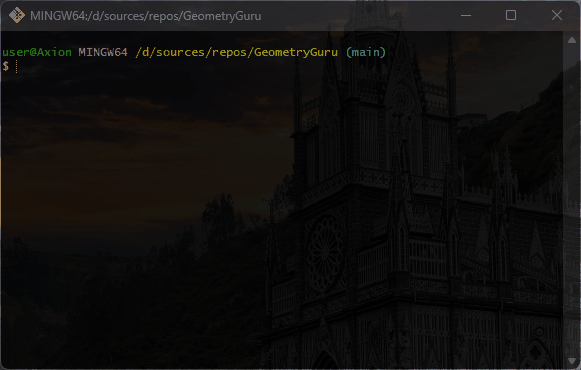
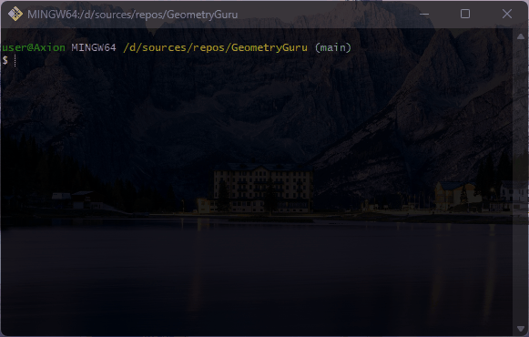
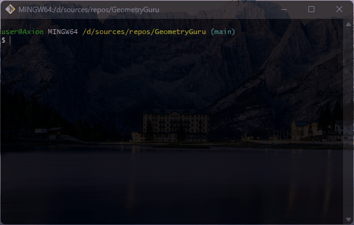

# 🧩 GeometryGuru
**Loyiha bir nechta arifmetik amallarni va tub sonlar ustida ishlay oladi**

## ⚙️ Xususiyatlari
*Bu loyiha quyidagi amallarni bajaradi:*
- *Sonning darajasini topish:*                  

- *[1; n] intervalda tub sonlar va ularning yig'indisini hisoblash:*  

- *Arifmetik amallarni hisoblash:*              

- *Uchta sondan kattasini topish*                             

- *Factorial hisoblash*                                          

- *Sonning tub ekanligini tekshirish*

- *Sonning palindrome ekanligini tekshirish*


## ⚒️ Ishga tushirish
1. .NET SDK yuklab oling:   
👉 [Yuklab olish](https://dotnet.microsoft.com/en-us/download)
2. Repository ni clone qiling:
```bash
git clone https://github.com/Lazizbek-Xoshimov/GeometryGuru.git
```
3. Terminalga quyidagi buyruqni yozing:
```bash
dotnet run
```

### 🧑‍💻 O'rgangan narsalarim
- *Console class bilan ishlash*
- *Parse method qo'llanilishi*
- *switch va if statement lardan foydalanish*
- *for, while, do while loop lardan foydalanish*
- *Qiymat qaytaradigan/qaytarmaydigan, parametr oladigan/olmaydigan methodlar bilan ishlash*